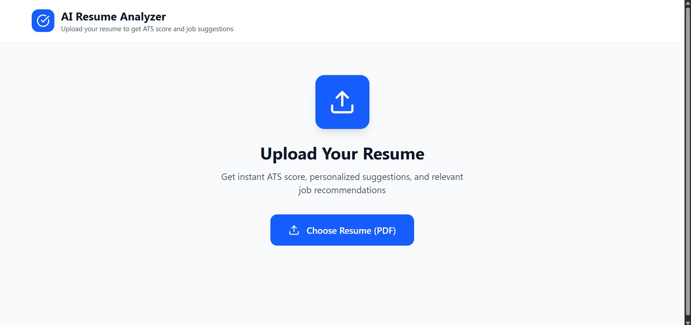
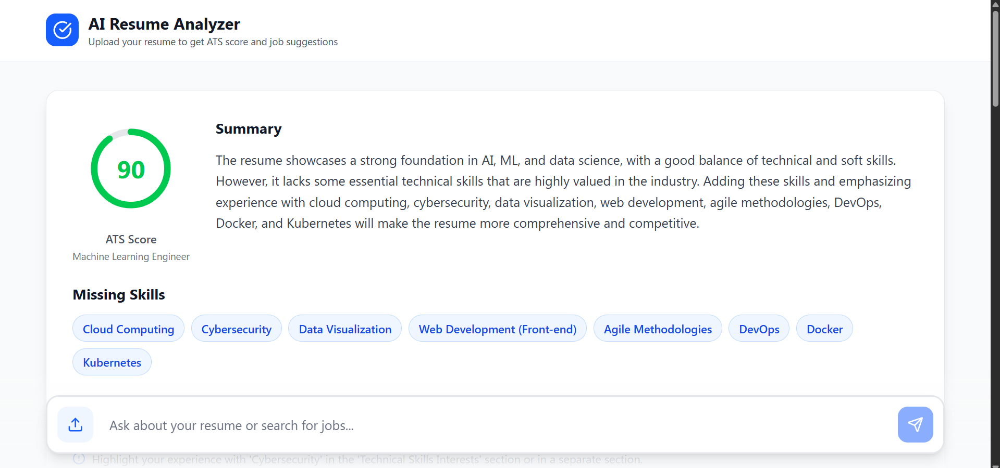
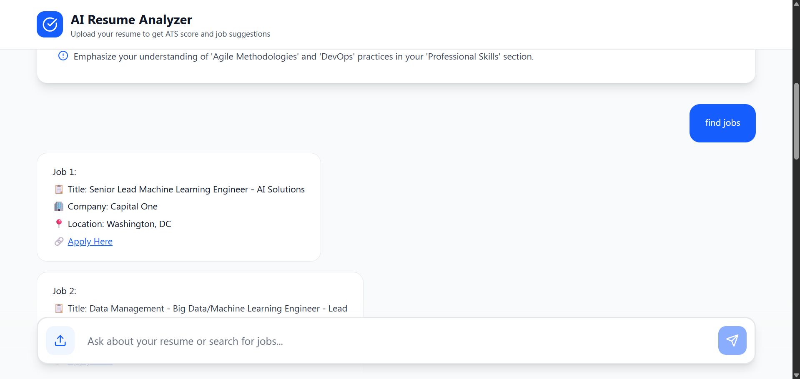

# 🎯 AI Resume Analyzer with Job Suggestions

An intelligent resume analysis system powered by RAG (Retrieval Augmented Generation) that provides ATS scoring, personalized improvement suggestions, and relevant job recommendations.


---

## ✨ Features

### 📊 **Resume Analysis**
- **ATS Score (0-100)**: Get an automated applicant tracking system score
- **Visual Score Indicator**: Color-coded circular progress (green/yellow/red)
- **Missing Skills Detection**: Identify gaps in your technical skillset
- **Actionable Suggestions**: Top 5 specific improvements for your resume
- **Role Identification**: Automatic detection of your primary job role

### 💬 **Interactive Q&A**
- Ask questions about your resume
- RAG-powered responses from resume content only
- Context-aware answers with no hallucinations

### 🔍 **Job Search Integration**
- Natural language job queries ("find me jobs", "search software engineer positions")
- Fetches real job listings from external API
- AI-formatted job cards with:
  - Job title and company
  - Location information
  - Direct application links (opens in new tab)
- Top 5 relevant opportunities based on your profile

### 🎨 **Modern UI/UX**
- Clean white/blue professional design
- Responsive and mobile-friendly
- Real-time processing status
- Smooth animations and transitions
- Session-based data (auto-clears on refresh)

---

## 🏗️ Architecture

```
┌─────────────────────────────────────────────────────────────┐
│                        USER UPLOADS RESUME                   │
└────────────────────────┬────────────────────────────────────┘
                         │
                         ▼
┌─────────────────────────────────────────────────────────────┐
│  Backend: ingest.py                                          │
│  ├─ Extract text from PDF                                   │
│  ├─ Split into chunks (400 chars)                           │
│  ├─ Generate embeddings (FastEmbed)                         │
│  └─ Store in FAISS vector database                          │
└────────────────────────┬────────────────────────────────────┘
                         │
                         ▼
┌─────────────────────────────────────────────────────────────┐
│  Backend: query.py (Auto-triggered)                         │
│  ├─ Retrieve full resume content                            │
│  ├─ Analyze with Groq LLM (Llama 3.1)                       │
│  ├─ Generate ATS score                                      │
│  ├─ Identify missing skills                                 │
│  └─ Create improvement suggestions                          │
└────────────────────────┬────────────────────────────────────┘
                         │
                         ▼
┌─────────────────────────────────────────────────────────────┐
│  Frontend: Display Analysis                                  │
│  ├─ ATS Score: 85/100 (with colored circle)                │
│  ├─ Missing Skills: [Docker, Kubernetes, AWS, ...]         │
│  ├─ Top 5 Suggestions: [Add certifications, ...]           │
│  └─ Summary: Professional overview                          │
└────────────────────────┬────────────────────────────────────┘
                         │
                         ▼
┌─────────────────────────────────────────────────────────────┐
│  User Interaction                                            │
│  ├─ Regular Questions → RAG Query (query.py)                │
│  └─ Job Search → API Call (jobs.py) → LLM Format           │
└─────────────────────────────────────────────────────────────┘
```

---
## PREVIEW:-







---

## 🚀 Tech Stack

### **Backend**
- **Framework**: FastAPI (async, high-performance)
- **LLM**: Groq API (Llama 3.1-8B Instant)
- **Vector Store**: FAISS (Facebook AI Similarity Search)
- **Embeddings**: FastEmbed (sentence-transformers/all-MiniLM-L6-v2)
- **RAG Framework**: LangChain
- **PDF Processing**: PyPDF
- **Job API**: JSearch (RapidAPI)

### **Frontend**
- **Framework**: React 18 + Vite
- **Styling**: Tailwind CSS
- **Icons**: Lucide React
- **Notifications**: React Toastify
- **HTTP Client**: Fetch API

### **Deployment**
- **Backend**: Railway
- **Frontend**: Vercel
- **Database**: None (session-based, ephemeral storage)

---

## 📦 Installation & Setup

### **Prerequisites**
- Python 3.11+
- Node.js 18+
- Groq API Key ([Get free key](https://console.groq.com))
- RapidAPI Key (optional, for real jobs)

---

### **Backend Setup**

1. **Clone Repository**
```bash
git clone https://github.com/kramit624/ai-resume-analysis-backend.git
cd ai-resume-analyzer
```

2. **Install Dependencies**
```bash
pip install -r requirements.txt
```

3. **Configure Environment Variables**
```bash
cp .env.example .env
```

Edit `.env`:
```env
GROQ_API_KEY=your_groq_api_key_here
RAPIDAPI_KEY=your_rapidapi_key_here  # Optional
```

4. **Run Backend**
```bash
uvicorn app:app --reload
```

Backend runs at: `http://localhost:8000`

---

### **Frontend Setup**

1. **Clone Repository**
```bash
git clone https://github.com/kramit624/ai-resume-analysis-frontend.git
cd ai-resume-analyzer
```

2. **Navigate to Frontend**
```bash
cd frontend
```

3. **Install Dependencies**
```bash
npm install
```

4. **Update API URL** (in `src/App.jsx`)
```javascript
const API_URL = "http://localhost:8000"; // For local development
// const API_URL = "https://your-backend.railway.app"; // For production
```

5. **Run Frontend**
```bash
npm run dev
```

Frontend runs at: `http://localhost:5173`

---

## 📚 API Documentation

### **Endpoints**

#### `POST /upload`
Upload resume PDF for analysis

**Request:**
```bash
curl -X POST http://localhost:8000/upload \
  -F "file=@resume.pdf"
```

**Response:**
```json
{
  "status": "uploaded",
  "filename": "resume.pdf",
  "message": "Resume is being analyzed..."
}
```

**Constraints:**
- File type: PDF only
- File size: Max 1MB
- Single file per upload

---

#### `GET /analysis`
Get resume analysis results

**Request:**
```bash
curl http://localhost:8000/analysis
```

**Response:**
```json
{
  "status": "complete",
  "analysis": {
    "ats_score": 85,
    "primary_role": "Software Engineer",
    "missing_skills": ["Docker", "Kubernetes", "AWS"],
    "suggestions": [
      "Add cloud computing certifications",
      "Include more action verbs",
      "Quantify achievements with metrics",
      "Add a professional summary section",
      "Highlight leadership experience"
    ],
    "summary": "Experienced software engineer with strong full-stack development skills..."
  }
}
```

---

#### `POST /ask`
Ask questions about resume or search jobs

**Request:**
```bash
curl -X POST http://localhost:8000/ask \
  -H "Content-Type: application/json" \
  -d '{"question": "What are my key technical skills?"}'
```

**Response (Regular Q&A):**
```json
{
  "question": "What are my key technical skills?",
  "answer": "Based on your resume, your key technical skills include Python, JavaScript, React, Node.js, SQL, and Git."
}
```

**Response (Job Search):**
```json
{
  "question": "find software engineer jobs",
  "answer": "Job 1:\nTitle: Senior Software Engineer\nCompany: Tech Corp\n..."
}
```

---

#### `GET /status`
Check system status

**Request:**
```bash
curl http://localhost:8000/status
```

**Response:**
```json
{
  "vectorstore_exists": true,
  "uploaded_files": ["resume.pdf"],
  "analysis_ready": true
}
```

---

#### `DELETE /clear`
Clear all data (resume, analysis, vectorstore)

**Request:**
```bash
curl -X DELETE http://localhost:8000/clear
```

**Response:**
```json
{
  "status": "success",
  "message": "All data cleared"
}
```

---

## 🎮 Usage Guide

### **Step 1: Upload Resume**
1. Open application in browser
2. Click "Choose Resume (PDF)"
3. Select your PDF resume (max 1MB)
4. Wait for upload (~5 seconds)

### **Step 2: Analyze Resume**
1. Click "Analyze Resume" button
2. Wait for processing (~30-60 seconds)
3. View results:
   - **ATS Score**: Color-coded circle (green/yellow/red)
   - **Missing Skills**: Blue chip badges
   - **Top 5 Suggestions**: Actionable improvements
   - **Summary**: Professional overview

### **Step 3: Ask Questions**
Type questions in the input box:

**Examples:**
- "What is my work experience?"
- "List all my technical skills"
- "What certifications do I have?"
- "Summarize my education background"

### **Step 4: Find Jobs**
Search for relevant job opportunities:

**Examples:**
- "Find jobs for me"
- "Search software engineer positions"
- "Show me remote developer jobs"
- "Job opportunities in AI/ML"

**Job Response Format:**
```
Job 1:

📋 Title: Senior Software Engineer
🏢 Company: Tech Corp
📍 Location: San Francisco, CA

🔗 https://apply-link.com  (clickable)
```

### **Step 5: Upload New Resume**
- Click upload icon (📤) in chat input
- Select new PDF
- System clears old data automatically
- New analysis begins

---

## 🔧 Configuration

### **Adjust ATS Scoring Criteria**

Edit `query.py`:
```python
ATS_ANALYSIS_PROMPT = PromptTemplate(
    input_variables=["resume_content"],
    template="""
    Analyze this resume based on:
    - Keyword optimization (30%)
    - Format and structure (25%)
    - Skills relevance (25%)
    - Experience clarity (15%)
    - Action verbs (5%)
    ...
    """
)
```

### **Change Embedding Model**

Edit `ingest.py` and `query.py`:
```python
embeddings = FastEmbedEmbeddings(
    model_name="sentence-transformers/all-mpnet-base-v2",  # Better quality
    max_length=512
)
```

### **Adjust Chunk Size**

Edit `ingest.py`:
```python
text_splitter = RecursiveCharacterTextSplitter(
    chunk_size=600,  # Increase for more context
    chunk_overlap=100
)
```

### **Change LLM Model**

Edit `query.py` and `jobs.py`:
```python
model="llama-3.1-70b-versatile"  # More powerful model
# model="llama-3.3-70b-versatile"  # Latest model
```

---

## 🌐 Deployment

### **Deploy Backend to Railway**

1. **Push to GitHub**
```bash
git add .
git commit -m "Initial commit"
git push origin main
```

2. **Create Railway Project**
   - Go to [Railway.app](https://railway.app)
   - Click "New Project" → "Deploy from GitHub"
   - Select your repository

3. **Add Environment Variables**
   - Go to Variables tab
   - Add `GROQ_API_KEY`
   - Add `RAPIDAPI_KEY` (optional)

4. **Deploy**
   - Railway auto-detects Python
   - Deployment takes 2-3 minutes
   - Get your public URL

---

### **Deploy Frontend to Vercel**

1. **Build Frontend**
```bash
cd frontend
npm run build
```

2. **Deploy to Vercel**
```bash
npm install -g vercel
vercel
```

3. **Update API URL**
   - Edit `src/App.jsx`
   - Change `API_URL` to your Railway URL

4. **Redeploy**
```bash
vercel --prod
```

---

## 📁 Project Structure

```
ai-resume-analyzer/
├── backend/
│   ├── app.py                 # FastAPI main application
│   ├── ingest.py              # PDF processing & embeddings
│   ├── query.py               # Resume analysis & Q&A
│   ├── jobs.py                # Job search integration
│   ├── requirements.txt       # Python dependencies
│   ├── .env.example           # Environment variables template
│   ├── .gitignore             # Git ignore file
│   ├── uploads/               # Uploaded resumes (auto-created)
│   └── vectorstore/           # FAISS vector store (auto-created)
│
├── frontend/
│   ├── src/
│   │   ├── App.jsx            # Main React component
│   │   └── main.jsx           # React entry point
│   ├── public/
│   ├── index.html
│   ├── package.json
│   ├── tailwind.config.js
│   ├── vite.config.js
│   └── .gitignore
│
└── README.md                  # This file
```

---

## 🐛 Troubleshooting

### **Issue: "Processing timeout"**
**Solution:**
- Increase timeout in `App.jsx`: `maxAttempts = 120`
- Reduce `MAX_CHUNKS` in `ingest.py` to 100
- Use smaller embedding model

### **Issue: "No jobs found"**
**Solution:**
- Verify `RAPIDAPI_KEY` is set correctly
- Check API quota/limits at RapidAPI
- System falls back to mock data if API fails

### **Issue: "File too large"**
**Solution:**
- Compress PDF using online tools
- Maximum allowed size is 1MB
- Remove unnecessary images from resume

### **Issue: "Low ATS score"**
**Possible reasons:**
- Missing keywords for target role
- Poor formatting (inconsistent fonts, spacing)
- Lack of quantifiable achievements
- No action verbs (achieved, led, developed)
- Missing critical sections (skills, experience)

### **Issue: "Analysis taking too long"**
**Solution:**
- Check Railway logs for errors
- Reduce chunk size in `ingest.py`
- Verify Groq API key is valid
- Check API rate limits

---

## 🔐 Security Notes

- ✅ Resume data is **ephemeral** (cleared on refresh)
- ✅ No data stored permanently
- ✅ Session-based processing
- ✅ API keys stored in environment variables
- ⚠️ Do not commit `.env` file to GitHub
- ⚠️ Use HTTPS in production
- ⚠️ Add rate limiting for production deployment

---

## 📊 Performance

### **Processing Times**
- Upload: ~5 seconds
- Analysis: ~30-60 seconds
- Q&A Response: ~2-3 seconds
- Job Search: ~3-5 seconds

### **Resource Usage**
- Memory: ~200MB (backend)
- Storage: Temporary (cleared on restart)
- API Calls: 1-2 per analysis + 1 per query

---

## 👨‍💻 Author

**AMIT RAJ**

---


## ⭐ Show Your Support

If you found this project helpful, please consider:
- ⭐ Starring the repository
- 🐦 Sharing on Twitter
- 📝 Writing a blog post
- 🤝 Contributing to the project

---

## 📈 Stats


---

<div align="center">

**Built with ❤️ using FastAPI, LangChain, and Groq**

[⬆ Back to Top](#-ai-resume-analyzer-with-job-suggestions)

</div
